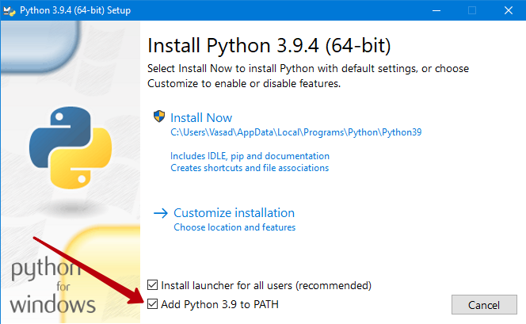
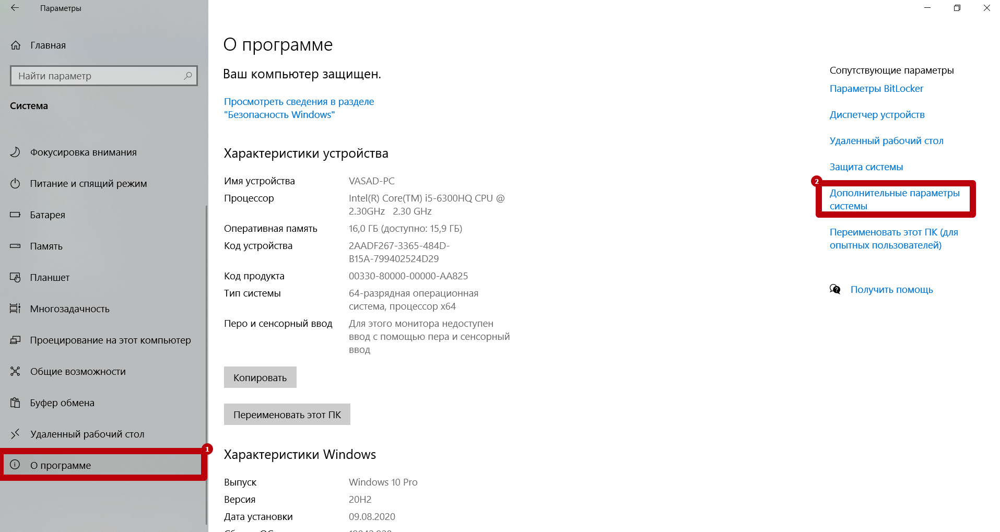
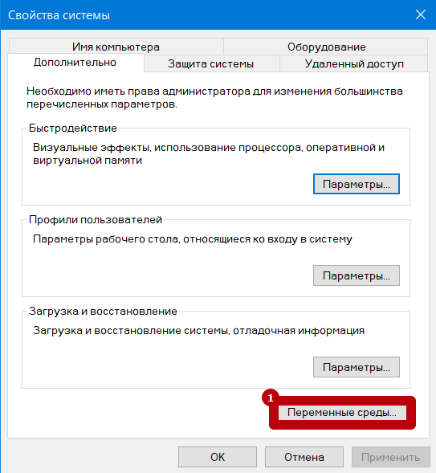
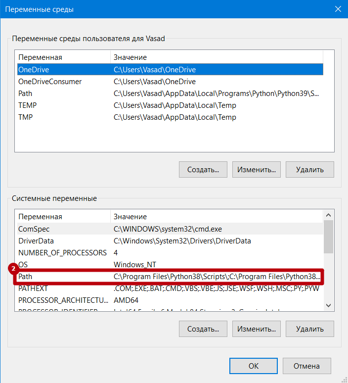

# Тест 573
### Описание
##### Главный файл avto_573.py
Логирование присходит внутри консоли без записи в файл, 
поэтому для избежания потери лога скрипт останавливается 
путём закрытия кнсоли. Изпользуется дополнительные ПО взависимости от ОС.
Можно запустить отдельные тесты вводя их номера или череду одного из тестов:
- 1 - http
- 2 - email*
- 3 - im*
- 4 - voip(None)*
- 5 - ftp
- 6 - telnet
- 7 - ssh
- 8 - https
- Все - пустая строка.
> 168 >>> Запуск тестов для http, telnet, https

> 111 >>> Запуск трёх подряд тестов http

___
## Дополнитльное ПО

### Windows:
1. Установить Python не ниже v3.8. При установки обязательно
   указать добавление в PATH.
   
2. Установить Putty
3. Установить Chrome >= v90
### Linux:
1. Установить wget командой >>> sudo apt install wget
2. Установить Chrome >= v90
___
## Установка chromedriver и других модулей теста.
Chromedriver официальный драйвер для управления Chrome.
Скрипт использует библиотеку selenium для управления браузером.
### Windows:
1. На C:\ скопировать директорию chromedriver из test_573_vХ.х.х/soft_for_script/win/
2. Добавить в PATH путь C:\chromedriver:
   
   
   
   
   - Проверка установки chromedriver в cmd командой >>> chromedriver
   - Проверка установки wget в cmd командой = >>> wget
4. Установка selenium в cmd командой >>> pip3 install selenium
5. Установка slixmpp в cmd командой >>> pip3 install slixmpp

### Linux:
1. Переходим в директорию /test_573/soft_for_script/linux
2. Запустить скрипт avto_setting.sh или выполняем команды:
   - sudo mv chromedriver /usr/local/bin/chromedriver
   - sudo chown root:root /usr/local/bin/chromedriver
   - sudo chmod +x /usr/local/bin/chromedriver
3. Проверка установки командой >>> chromedriver
4. Установка selenium для тестов 1 и 8 >>> pip3 install selenium
5. Установка slixmpp для теста 3 >>> pip3 install slixmpp
___
## Примечание к тестам
По умолчанию все автоответчики (*_server.py) запущенны в терминале на тестовом ПК 139 Linux
Для доступа к нему по AnyDesk писать мне, он стоит в сервере в 109.

### №2 EMAIL
Для работы этого теста необходимо запустить ответную часть test_email_server.py на другом ПК.
Скрипт работает до принудительного завершения, логирование происходит в только в консоли.

Для его работы необходимо ПО:
1. Установить Python не ниже v3.8. При установке обязательно
   указать добавление в PATH.
   

### №3 IM
Для работы этого теста необходимо запустить ответную часть test_im_serv.py на другом ПК.
Скрипт работает до принудительного завершения, логирование происходит в только в консоли.

Для его работы необходимо ПО:
1. Установить Python не ниже v3.8. При установке обязательно
   указать добавление в PATH.
   
2. Установка slixmpp для теста 3 >>> pip3 install slixmpp
